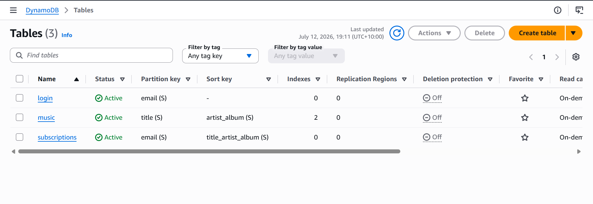
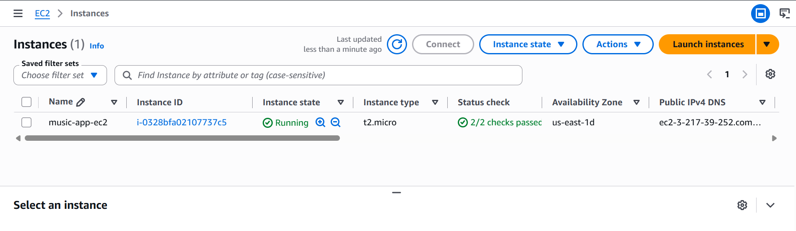
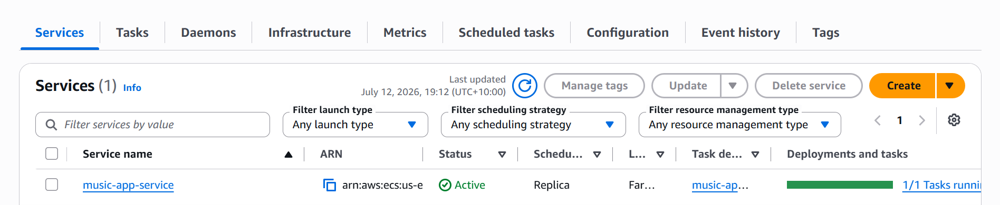
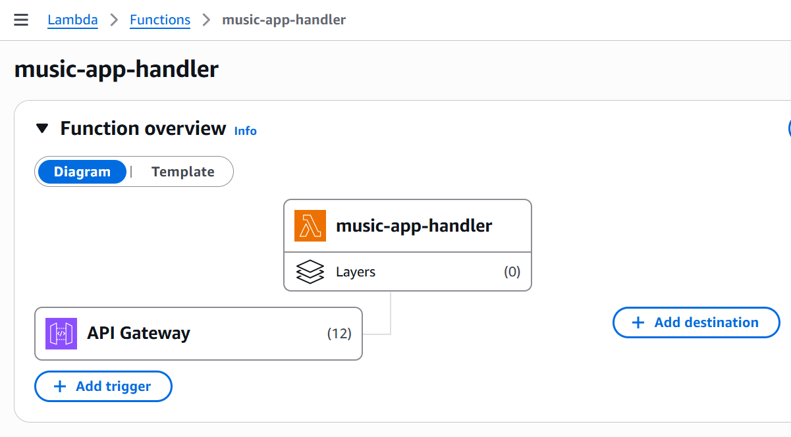
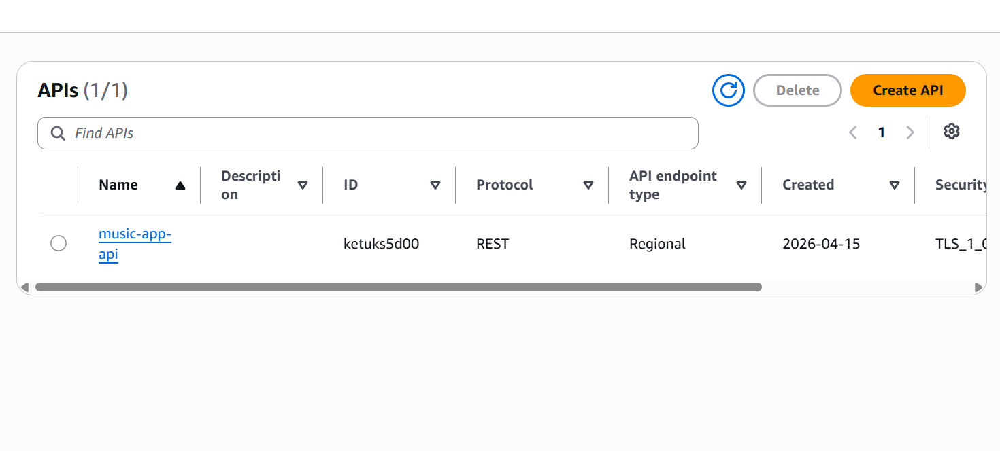

# ☁️ Cloud Music Subscription App

A serverless-meets-containerised music subscription platform built on AWS, demonstrating three parallel backend deployment strategies (EC2, ECS/Fargate, and Lambda) hitting a shared DynamoDB data layer.

## 🏗️ Architecture

The same Flask application logic is deployed **three different ways** to compare deployment models:

| Backend | Compute Model | Notes |
|---|---|---|
| **EC2** | Traditional VM | `t2.micro`, Amazon Linux 2023, Flask served directly |
| **ECS (Fargate)** | Serverless containers | Docker image via ECR, 0.25 vCPU / 0.5 GB RAM |
| **Lambda** | Function-as-a-Service | Python 3.12, API Gateway (REST, proxy integration) |

All three share:
- **Amazon S3** — static frontend hosting + album art storage
- **Amazon DynamoDB** — `login`, `music`, and `subscriptions` tables
- **IAM** — least-privilege execution roles

```
┌─────────────┐      ┌──────────────────────────────┐      ┌──────────────┐
│   S3        │─────▶│  Flask API (3 deployments)    │─────▶│  DynamoDB    │
│  (frontend) │      │  EC2 │ ECS Fargate │ Lambda    │      │  3 tables    │
└─────────────┘      └──────────────────────────────┘      └──────────────┘
```

## 📸 Screenshots

**DynamoDB Tables**


**EC2 Instance Running**


**ECS Fargate Cluster**


**Lambda Function**


**API Gateway**


## 🗄️ Data Model

**`music`** — partition key `title`, sort key `artist_album` (composite `artist#album`)
- GSI `artist-year-index` (PK: `artist`, SK: `year`) — query an artist's catalogue by year
- LSI `title-year-index` — query a title's releases by year
- 137 songs loaded, including 5 handled title-collision edge cases

**`login`** — partition key `email`, seeded demo accounts

**`subscriptions`** — partition key `email`, sort key `title_artist_album`

## ⚙️ Tech Stack

- **Backend:** Python, Flask, Flask-CORS
- **Compute:** EC2, ECS Fargate (Docker/ECR), Lambda
- **API:** Amazon API Gateway (REST, Lambda proxy integration)
- **Storage:** Amazon S3, DynamoDB
- **IaC/Setup:** Python seed scripts for table creation and data loading

## 🧩 Key Engineering Challenges Solved

- **CORS with custom headers** — a custom `x-user-email` header was blocked by CORS preflight; resolved by moving identity into the request body/params instead.
- **Special characters breaking client state** — song titles with special characters broke a naive DOM-lookup pattern for the subscribe button; solved with a JS object (`songStore`) keyed by song ID instead of raw title strings.
- **Composite sort keys for collision handling** — 5 songs shared titles across different artists/albums; the `artist_album` composite sort key resolved the collisions without denormalising the table.
- **Lambda proxy integration misconfiguration** — a disabled proxy integration silently broke authentication; re-enabling it fixed login.
- **Container build/runtime debugging** — resolved Dockerfile `COPY` path issues and a missing ECS service-linked role (`aws iam create-service-linked-role`).

## 📁 Repository Structure

```
.
├── scripts/
│   ├── 01_create_login_table.py
│   ├── 02_create_music_table.py
│   ├── 03_load_music.py
│   ├── 04_upload_images_s3.py
│   └── 05_create_subscriptions_table.py
├── ec2_app/
│   ├── app.py            # Flask backend (shared by EC2 & ECS)
│   ├── Dockerfile
│   └── requirements.txt
├── lambda/
│   └── handler.py         # Lambda entry point
├── frontend/
│   ├── index.html          # Lambda-backed UI
│   ├── index_ec2.html       # EC2-backed UI
│   └── index_ecs.html       # ECS-backed UI
└── data/
    └── songs.json
```

## 🚀 Running It Yourself

This was built against an AWS Academy Learner Lab sandbox, so live endpoints aren't published here. To stand it up in your own AWS account:

1. Create the DynamoDB tables using the scripts in `scripts/`.
2. Deploy `ec2_app/app.py` to an EC2 instance (or build the Docker image from `ec2_app/Dockerfile` and push to ECR for ECS/Fargate).
3. Deploy `lambda/handler.py` behind an API Gateway REST API with Lambda proxy integration enabled.
4. Update the API base URL in the relevant `frontend/index*.html` file and host it on S3 (static website hosting).

Set your own AWS credentials via the AWS CLI (`aws configure`) — never commit credentials to this repo.


## 📄 License

MIT — feel free to reference for learning purposes.
